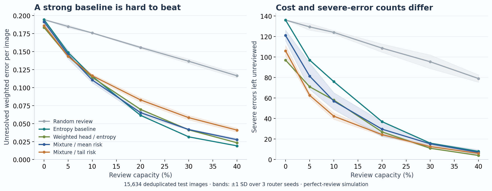

# Risk-Aware Decision Routing

A ViT-based system that selects which disaster images to send for review under a fixed budget.

## What I built

- **Three prediction heads:** the original ViT head, a linear head, and a severity-weighted head.
- **A learned risk router:** a small MoE predicts error costs; mean-risk and CVaR policies rank cases for review.
- **An adoption check:** switch from entropy routing only when a separate development subset supports the change.
- **A reproducible evaluation:** deduplicated MEDIC data, three router seeds, and blur/JPEG tests on 3,000 images.

## Results

15,634 test images, 20% review capacity:

| Policy | Weighted error ↓ | Severe errors left ↓ |
|---|---:|---:|
| Entropy baseline | **0.0614** | 37.0 |
| MoE — mean risk | 0.0652 | 29.7 |
| MoE — tail risk | 0.0828 | **24.3** |

Tail routing left **34% fewer severe errors**, with **35% higher total weighted cost**.
None of the three adoption checks supported a switch, so the default remains entropy.

Results average three router seeds with one fixed backbone. Error costs are 1/3/8
by severity; review is simulated as perfect. This is an exploratory study.



## Run

Python 3.10+, from the repository root:

```bash
python -m pip install -e .
python -m unittest discover -s tests -v

# Requires local MEDIC data and the original ViT checkpoint.
bash scripts/reproduce.sh --full
```

The 23 tests run without the dataset. Data, weights, and caches are not bundled.
See the [setup guide](docs/reproduction.md) for required files and inference commands.

[Full results](reports/results.md) · [Method](docs/method.md) · [Related work](docs/related-work.md)

Code: `src/radr/` · Tests: `tests/` · Tables and figures: `reports/`
