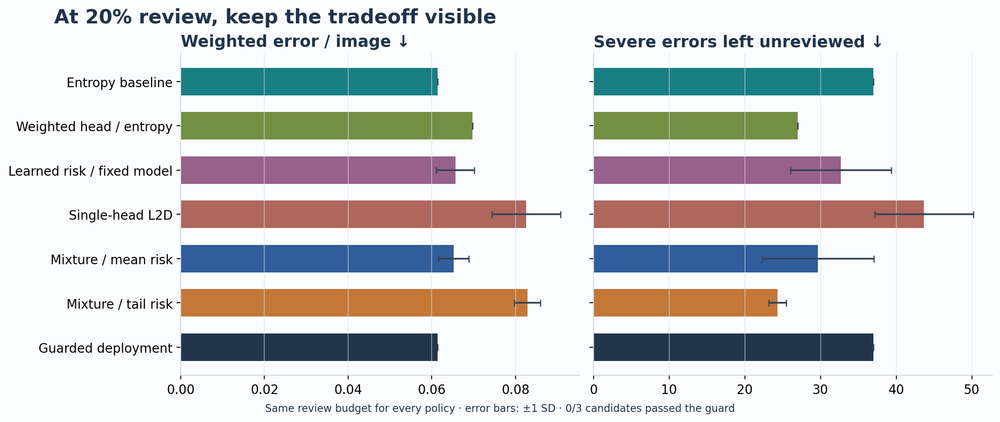

# Risk-Aware Decision Routing

**When review time is limited, which disaster images deserve a second look?**

[中文说明](README.zh-CN.md) · [Experiment results](reports/results.md) · [Method](docs/method.md) · [Reproduce the study](docs/reproduction.md)

A disaster-image classifier can be accurate on average and still miss cases that
matter. This project studies how to spend a limited review budget: use model
uncertainty, learn which model to trust, or prioritize the tail of predicted error
costs.

It combines a fixed ViT, a small mixture of risk predictors, and a review queue
with an explicit capacity limit. A separate development-data check decides
whether the learned policy has enough evidence to replace the baseline.



## What we found

On **15,634 deduplicated MEDIC test images**, with **20% sent for review**:

| Policy | Weighted error per image ↓ | Severe errors left unreviewed ↓ |
|---|---:|---:|
| Original ViT + entropy review | **0.0614** | 37.0 |
| Severity-weighted head + entropy | 0.0697 | 27.0 |
| Learned mixture: mean risk | 0.0652 | 29.7 |
| Learned mixture: tail risk | 0.0828 | **24.3** |
| Guarded policy | **0.0614** | 37.0 |

Tail-focused routing left roughly **34% fewer severe errors**, but increased
total weighted cost by roughly **35%**. The guard found insufficient evidence
to switch in all three runs, so the default policy stays with entropy.

That tradeoff is the central result. More complex routing changed *which*
mistakes remained; it did not produce a better outcome on every measure.

These numbers average three router seeds with one fixed backbone. Costs are
illustrative weights of 1/3/8 for little-or-no, mild, and severe damage.
The table assumes review resolves each deferred case correctly; real human
outcomes were not collected. See the [full results](reports/results.md) for
variation, reviewer-quality sensitivity, and limitations.

## How it works

1. **Predict.** A shared image encoder feeds the original classification head,
   a linear head, and a severity-weighted linear head.
2. **Estimate risk.** A small learned mixture predicts each head's distribution
   over error costs. True labels and severity are not routing inputs.
3. **Allocate review.** Select a model and send the highest-priority cases to a
   review queue, within the requested budget.
4. **Check before switching.** Use a separate guard subset to compare the chosen
   candidate with entropy. Keep the baseline if the evidence is insufficient.

This is a mixture of **risk predictors**, not a sparse language-model MoE.
All heads run before routing; the study makes no inference-speedup claim.
The guard is an empirical adoption check, not a certified safety bound.

## Get started

Python 3.10+ is required. From a Linux or WSL shell:

```bash
git clone https://github.com/zhuoyl03/Risk-Aware-Decision-Routing.git
cd Risk-Aware-Decision-Routing
python -m venv .venv
source .venv/bin/activate
python -m pip install -e .
python -m unittest discover -s tests -v
```

A fresh checkout can run the tests and inspect every committed result.
**Image experiments additionally require MEDIC and the original ViT checkpoint;
neither is bundled.** The [reproduction guide](docs/reproduction.md) explains the
file layout, commands, and tested environment.

With those local artifacts available:

```bash
# Rebuild image features, fit routers, run corruption tests, and create reports.
bash scripts/reproduce.sh --full

# Later runs can reuse the feature cache.
bash scripts/reproduce.sh --cached

# Route a cached batch: 20 images, four review slots.
radr-route --feature-cache out/features/test.npz --limit 20
```

You can also pass your own batch with `radr-route --images a.jpg b.jpg ...`.
Review slots are rounded down: a 20% budget gives no slots to batches smaller
than five. The output proposes a label and marks the case for model handling
or review; it does not invent a completed human decision.

## Explore the evidence

- [Budget and risk curves](reports/figures/risk_coverage.png)
- [The three guard decisions](reports/figures/guard_evidence.png)
- [Actual blur and JPEG experiments](reports/figures/image_corruptions.png)
- [Imperfect-reviewer sensitivity](reports/figures/reviewer_sensitivity.png)
- [All policies and seeds, as CSV](reports/routing_curves.csv)

For a single-page visual report, open `reports/index.html` in a local browser.
GitHub displays the HTML source rather than hosting the page.

The [experiment protocol](docs/experiment-plan.md) records the initial plan and
later exploratory additions. The [pilot results](reports/pilot/) remain available.
The [validation record](reports/validation.json) covers 23 passing tests,
image/cache agreement, and an identical repeat of the result CSVs.

## Project layout

| Location | Contents |
|---|---|
| `src/radr/` | Data audit, models, risk metrics, routing, experiments, reporting |
| `tests/` | Mathematical edge cases and pipeline invariants |
| `docs/` | Method, protocol, related work, reproduction |
| `reports/` | Results, provenance, PNG/SVG figures, local HTML report |
| `archive/legacy/` | Original training and evaluation scripts |
| `data/`, `out/` | Local datasets, weights, caches, logs; excluded from Git |

## Scope and next steps

The backbone used development data for checkpoint selection, and historical
test results had already been viewed. These are exploratory results. Exact
hashes remove byte-identical duplicates, not near-duplicates. Source slices
and corruption tests do not establish generalization to unseen disaster events.

A useful next study would collect actual reviewer outcomes and evaluate on fresh,
event-held-out data. At the main operating point, CVaR90 is also proportional to
mean residual loss because fewer than 10% of cases retain errors; the two metrics
should not be presented as independent wins.

The [related-work notes](docs/related-work.md) connect this study to recent work
on learning to defer, multi-expert underfitting, and CVaR. This repository does
not claim a new theorem or state-of-the-art performance.

MEDIC is described by [Alam et al.](https://arxiv.org/abs/2108.12828) and is released
under CC BY-NC-SA 4.0. Refer to the dataset's own license and terms; they do not
automatically license this repository's code or checkpoint.
